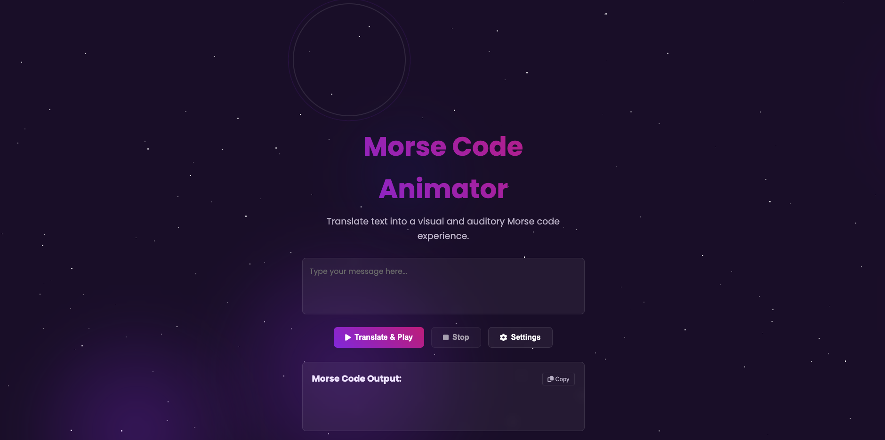

# 🗣️ Morse Code Generator

[](LICENSE)  
  
  
  


---

## 🛰️ About the Project

**Morse Code Generator** is a simple, intuitive web tool that converts plain text into Morse code (and optionally vice versa, if implemented).  
It’s built with **HTML**, **CSS**, and **JavaScript**, with focus on clarity, usability, and an elegant minimal UI.

> 🔹 *"From letters to dots and dashes — communicate in Morse."*

---

## 🧠 Features

- ✅ Text → Morse code conversion  
- ✅ Copy Morse code output to clipboard  
- ✅ Clear / reset functionality  
- ✅ (Optional) Morse → Text decoding (if included)  
- ⏱️ (Optional) Playback of Morse audio (dot/dash beeps)  
- 📱 Responsive — works well on desktop & mobile  

---

## 🛠️ Built With

| Technology | Purpose |
|------------|---------|
| **HTML5**  | Structure & markup |
| **CSS3**   | Styling, layout, responsiveness |
| **JavaScript (ES6+)** | Conversion logic & UI handling |
| *(Optional libs / audio APIs)* | (If used) sound playback, animations |

---

## 🖼️ Demo / Preview

🔗 **Live Demo:** *(If deployed – insert link here)*  
📂 **Repository:** [GitHub Repo Link](https://github.com/sarangnayak/Morse-Code-Generator)

> *(Replace this with a screenshot or GIF of the working app)*  
> 

---

## ⚙️ Installation & Usage

### Prerequisites

- A modern web browser  
- (Optional) Local server (e.g. Live Server in VS Code) — though often you can open `index.html` directly

### Steps

1. Clone the repository  
   ```bash
   git clone https://github.com/sarangnayak/Morse-Code-Generator.git
   cd Morse-Code-Generator
   ```

   ```
   Morse-Code-Generator/
│
├── index.html        # Main HTML file
├── style.css         # Styling and UI layout
├── script.js         # Morse code logic & interactions
├── preview.png       # App preview image
└── README.md         # Documentation
```
